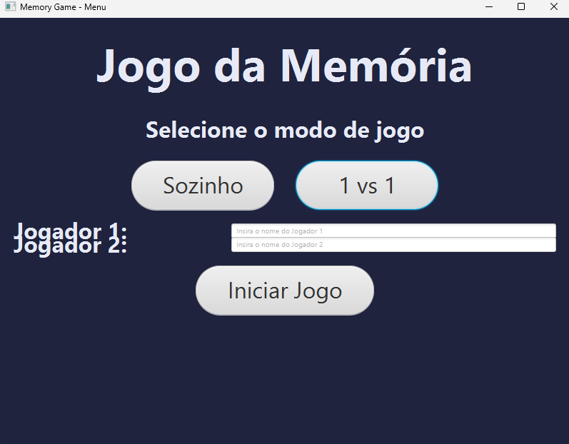

# 🧠 Jogo da Memória em JavaFX

Bem-vindo ao projeto Jogo da Memória, uma aplicação desktop clássica desenvolvida com Java e JavaFX. O jogo proporciona uma experiência divertida com uma interface gráfica limpa e recursos modernos, como salvamento automático e histórico de pontuações.

GitHub dos desenvolvedores: GabrielVitorSZz e yDaviDEAD1

### 🎮 Visão Geral

Este projeto foi criado como uma prática de aplicação dos conceitos de JavaFX, explorando arquitetura MVC, manipulação de arquivos JSON, troca de cenas com FXML, entre outros tópicos.

O jogo oferece:

* **Modos:** Sozinho ou 1 vs 1.
* **Salvamento automático** do estado do jogo.
* **Histórico de partidas** com placar e nomes dos jogadores.
* **Interface gráfica moderna** e responsiva.

### 🖼️ Telas do Jogo

#### Menu Principal

Permite selecionar o modo de jogo e inserir os nomes dos jogadores.



#### Tela de Jogo

Apresenta um tabuleiro 4x4 de cartas viradas. Os jogadores clicam para revelar pares e acumulam pontos.


#### Diagrama de Classe

Exibe a arquitetura MVC do projeto, separando controladores, modelo e persistência.


### ✨ Funcionalidades

* 🧍‍♂️ **Modo Solo:** Pratique sua memória sozinho.
* 🧑‍🤝‍🧑 **Modo 1 vs 1:** Competição entre dois jogadores com pontuação.
* 💾 **Salvamento Automático:** O estado do jogo é salvo automaticamente ao sair.
* 📈 **Histórico de Pontuações:** Resultados de partidas 1x1 são gravados e exibidos.
* 📝 **Nomes Personalizáveis:** Os jogadores podem inserir seus nomes.
* 🎨 **Interface Moderna:** Construída com FXML e estilizada com CSS.

### 🛠️ Tecnologias Utilizadas

* **Java** 11+
* **JavaFX** 17+
* **FXML**
* **Gson** 2.8+ (para serialização de dados JSON)
* **CSS** (para estilização da UI)

### 🚀 Como Executar o Projeto

#### ✅ Pré-requisitos

* JDK 11 ou superior.
* JavaFX SDK 17 ou superior ([Download JavaFX](https://gluonhq.com/products/javafx/)).
* IDE com suporte a Java (Eclipse, IntelliJ IDEA, VS Code com extensão Java).

#### 🧪 Passo a Passo

```bash
# 1. Clone o repositório
git clone [https://github.com/GabrielVitorSZz/JogoDaMemoria.git](https://github.com/GabrielVitorSZz/JogoDaMemoria.git)

# 2. Importe o projeto em sua IDE (Eclipse, IntelliJ, VS Code)

# 3. Configure o JavaFX:
 Estrutura do Projeto (Simplificada)
├── application/
│   ├── Main.java
│   ├── controller/
│   │   ├── MenuController.java
│   │   └── MemoryGameController.java
│   ├── model/
│   │   ├── CartaModel.java
│   │   ├── CartaMemoriaModel.java
│   │   ├── DeckCartasModel.java
│   │   ├── EstadoDoJogo.java
│   │   └── ResultadoPartida.java
│   ├── persistencia/
│   │   ├── GerenciadorDeEstado.java
│   │   └── GerenciadorDePontuacoes.java
│   ├── view/
│   │   ├── tela_menu.fxml
│   │   └── tela_jogo.fxml
├── images/
│   ├── diagrama.png
│   ├── menu.png
│   └── tabuleiro.jpg

📄 Licença
Este projeto é de uso educacional e livre para modificações. Fique à vontade para usar e aprimorar!
└── pom.xml (Se estiver usando Maven)
#    - Adicione o caminho do SDK JavaFX na configuração do projeto.
#    - Defina os módulos necessários: --add-modules javafx.controls,javafx.fxml

# 4. Execute a classe principal:
#    src/application/Main.java
